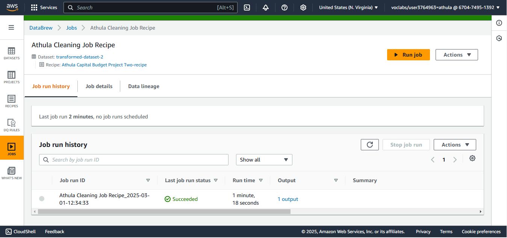
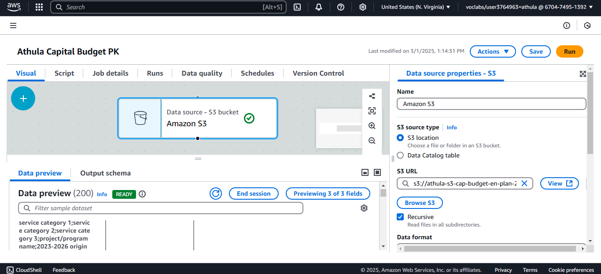
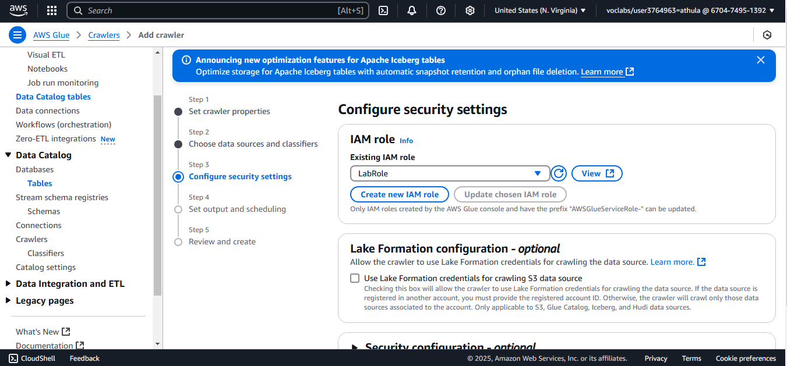
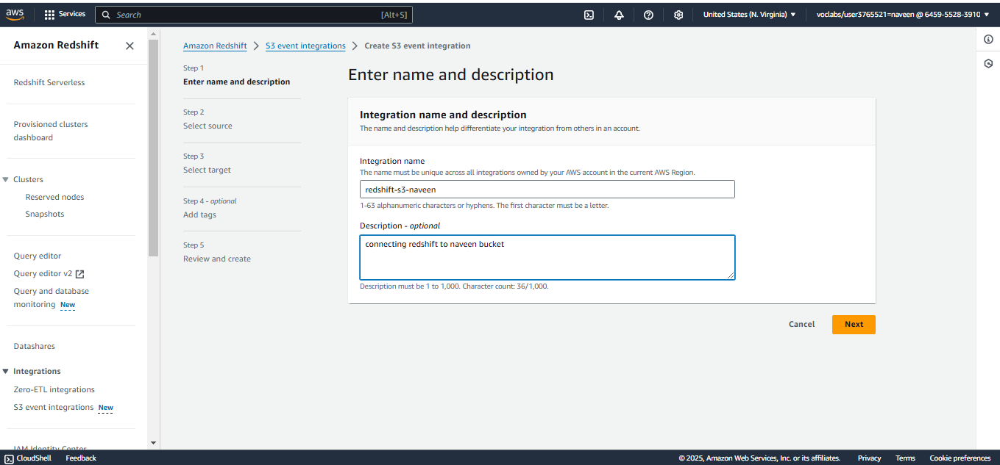
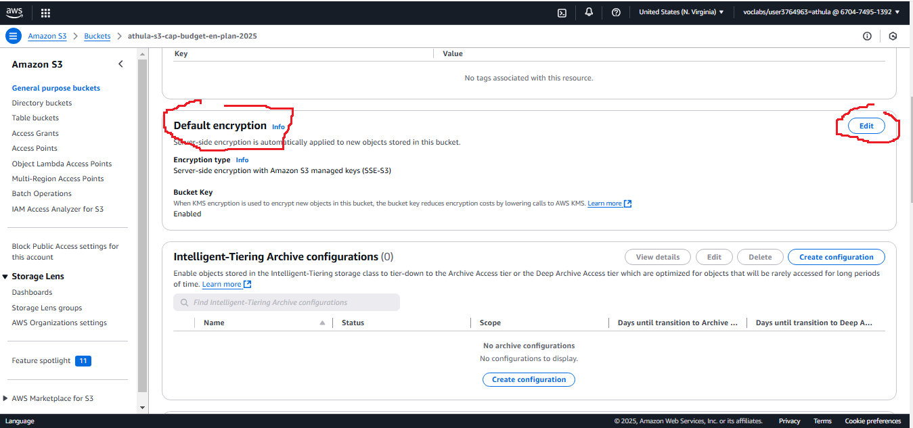
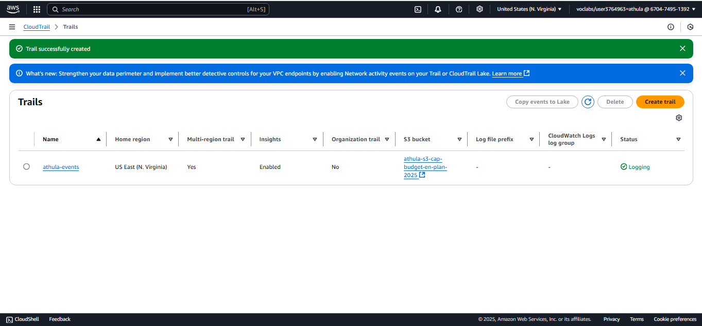

<h1>PART 1</h1>
<h1>Descriptive Analysis</h1>
<h3>Project Title:</h3> DAP Design and Implementation – Individual Task
<h3>Project Description:</h3> Descriptive Analysis of the City of Vancouver's Capital Budget and Funding Allocations.
<h3>Objective:</h3> The objective is to create data analytics platform for the City of Vancouver. To achieve this objective, the data will be migrated from the current platform to Amazon AWS platform. Specifically, this platform will use Amazon S3 platform as an affordable, scalable, secure, and easily accessible alternative. I will be using CSV dataset downloaded online for this task. The dataset used for this task is “2023-2026 Capital Plan and 2023 Capital Budget”. This data will be used to create and implement the AWS data analytics platform accessible to the stakeholders from their local machines. The capital plan and budget data used for this task contains info about budget category and budget allocations for each category for the financial years 2023 to 2026. This data analytics will help the stakeholders conduct analytics for making accurate and seamless decisions.
<h3>Dataset:</h3> The dataset consists of budgetary data for capital projects in Vancouver, with key features including:
Project Category: Infrastructure, parks, transportation, etc.
Budget Allocation Year: 2023, 2024, 2025, 2026.
Funding Sources: External funding, reserves, or city revenues.
Project Costs: Estimated costs associated with specific initiatives.
Regional Allocations: Funding distribution across different areas of the city.
This task will have five major steps including data ingestion, data profiling, data cleaning, data cataloging and summarization.
The figure below shows a summary map of our platform, as designed in draw.io
  
Edit Link: https://drive.google.com/file/d/1NOjUrj79Y4hjjrG8v6wZBlPGkHYNZTrz/view?usp=sharing 
<h3>Step 1: Data Ingestion </h3>
My first action was to create a bucket in Amazon AWS. I specifically chose Amazon S3 bucket to help in holding the data and to create an organized storage system, guaranteeing that this data will be intact when it is required for reproducibility. I chose a general-purpose bucket type, named it “athula-s3-cap-budget-en-plan-2025”, I had ACLs disabled, and I kept the other settings default.
  
  
After creating bucket, as can be seen in figure 1 above, I then upload our CSV data file into the bucket as can be seen in figure below.
  
<h3>Methodology:</h3>
1-	Data Collection and Preparation:
o	Load budget data into AWS S3 for centralized access.
o	Use AWS DataBrew for data profiling and initial cleaning to remove duplicates, handle missing values, and correct data types.
2-	Descriptive Statistics:
o	Summarize total and average costs per category.
o	Analyze year-wise allocation trends and major funding sources.
3-	Data Visualization:
o	Create Bar Charts: Show year-wise changes in funding across project categories.
o	Pie Charts: Display the proportion of funding from different sources.
o	Heatmaps: Illustrate regional differences in budget distribution.

4-	Customer Segmentation:
o	Segment customers based on their purchasing behavior (e.g., high-frequency vs. low-frequency buyers).
o	Analyze the purchasing patterns of different segments.
5-	Insights and Findings:
o	Summarize the insights derived from the analysis, highlighting:
	Peak shopping periods (e.g., holidays, weekends)
	Trends in product category sales over time
	Preferences in payment methods across customer segments
6-	Recommendations:
o	Provide actionable recommendations based on the findings to inform inventory management, targeted marketing campaigns, and promotional strategies.
<h3>Tools and Technologies:</h3>
•	Python (Pandas, Matplotlib, Seaborn) or Excel for data analysis
•	Data visualization tools (Tableau or Power BI) for creating dashboards
<h3>Deliverables:</h3>
•	A detailed report summarizing the methods, findings, and recommendations.
•	Visualizations and dashboards to present key insights clearly.
•	A presentation for stakeholders to communicate important findings and suggestions for future action.
This descriptive analysis project aims to provide a comprehensive understanding of customer purchase behaviors, enabling XYZ Retail to optimize its operations and enhance customer satisfaction.
<h3>Conclusion</h3>
This analysis enabled the City of Vancouver to understand critical patterns in its budget allocations. Using AWS services for storage, profiling, and processing ensured a streamlined and secure approach, while advanced visualization tools made the insights actionable for stakeholders. This project highlights the potential for data-driven decisions to enhance urban planning and resource management.

<h1>Diagnostic Analysis</h1>
<h3>Project Description:</h3> Diagnostic Analysis of Budget Allocation Changes in the City of Vancouver 
<h3>Project Title: </h3> Investigating the Causes of Budget Variations in Vancouver’s Capital Plan
<h3>Objective:</h3> The primary goal of this project is to conduct a diagnostic analysis to identify the underlying causes of variations in budget allocations across different regions and categories in the City of Vancouver’s 2023–2026 Capital Plan and 2023 Capital Budget. By analyzing diverse datasets, we aim to uncover factors influencing these variations and provide actionable insights to inform more effective financial strategies.
<h3>Background:</h3>  Over recent budget cycles, the City of Vancouver has observed notable shifts in capital allocations, raising concerns about alignment with urban priorities such as housing, infrastructure, and sustainability. Management seeks a thorough understanding of the drivers behind these changes to ensure the budget reflects the city’s strategic goals.
<h3>Dataset:</h3> The analysis leverages multiple datasets, including:
Budget Data: Yearly allocations across categories such as housing, transportation, and parks.
Demographic Data: Regional population density, growth trends, and socio-economic profiles.
Impact Data: Outcomes of previously funded projects, such as usage rates or community benefits.
Market and Economic Data: Regional economic indicators and trends affecting funding decisions.
<h3>Methodology:</h3>
1-	Data Collection and Preparation:
o	Consolidate datasets from various sources, including Vancouver's Open Data Portal and external economic reports.
o	Clean and normalize data to ensure consistency for analysis.
2-	Trend Analysis:
o	Perform year-over-year comparisons of budget allocations across regions and categories.
o	Identify key areas with significant increases or decreases in funding.
3-	Correlation Analysis:
o	Assess relationships between budget variations and external factors such as population growth, project outcomes, and economic conditions.
o	Apply statistical methods (e.g., regression analysis) to measure the influence of these variables on budget changes.
4-	Root Cause Analysis:
o	Engage city officials and stakeholders through interviews to gather qualitative insights on shifts in priorities.
o	Use diagnostic tools like the "5 Whys" or Fishbone Diagram to systematically investigate underlying causes.
5-	Segmentation Analysis:
o	Segment regions and project categories based on funding levels and demographic factors.
o	Analyze how resource allocation impacts different community groups.
6-	Synthesis of Findings:
o	Combine quantitative and qualitative insights to identify the primary drivers of budget variations.
o	Highlight patterns and inconsistencies in allocation practices.
<h3>Tools and Technologies:</h3>
•	SQL for data extraction and preprocessing.
•	AWS Services:
•	AWS DataBrew for data profiling and cleaning.
•	AWS Glue for ETL pipeline execution.
<h3>Deliverables:</h3>
•	A comprehensive diagnostic report that outlines the analysis process, findings, and confirmed root causes of the sales decline.
•	Visualizations and dashboards summarizing key metrics and trends.
•	Actionable recommendations for management, focusing on strategies to address identified issues and improve sales performance.
•	maintain a clear separation between raw and transformed datasets. 

<h3>Step 2: Data Profiling</h3>
This task is completed at Amazon AWS DataBrew link https://console.aws.amazon.com/databrew/ (when logged-in, the link redirects us to the proper Glue Databrew region)
To have a visualization of our data summary, I created an AWS Glue DataBrew project an named it “Athula Capital Budget Project” and the recipe named as “Athula Capital Budget Project”. I then connected this new project to the raw data I previously uploaded and stored in Amazon S3 bucket.
  
  
To connect my initially uploaded data, I chose connect to new data, then the option to search and select my initial data comes up, so I chose our raw data “athula-s3-cap-budget-en-plan-2025”,  as can be seen below:
  
Note that I have named our dataset as “dataset-athula-capital-budget-project-dataset”.
I have also given permission: role name as LabRole.
My data type is in excel CSV format
My data nature is separated by the delimiter “;”, so I chose it to help create columns in transforming my data to columns.
I am also treating my first row as header.
Here is a snapshot of my data transformation parameters while creating the project:
  
After creating our project (Athula Capital Budget Project) and connecting it to our raw data, the figure below shows the screen of our project data:
  
<h1>Data Wrangling</h1>
<h3>Project Description: </h3>
Data Wrangling for Budget Analysis at the City of Vancouver 
<h3>Project Title: </h3>
Data Wrangling for Enhanced Budget and Funding Insights
<h3>Objective:</h3> The primary goal of this project is to perform comprehensive data wrangling on the City of Vancouver’s 2023–2026 Capital Plan and 2023 Capital Budget datasets. By cleaning, transforming, and consolidating data, the project aims to prepare a high-quality dataset that provides actionable insights for budget allocation and planning.

<h3>Background:</h3> The City of Vancouver's budgeting process involves multiple datasets, including funding sources, project costs, and allocations across years and categories. However, the raw data often contains missing values, inconsistencies, and formatting issues, making it challenging to derive meaningful insights. This project focuses on preparing clean, consistent data for subsequent analysis and reporting.
<h3>Dataset:</h3> The datasets used in the wrangling process include:
Capital Budget Data: Allocations for infrastructure, parks, housing, and transportation.
Funding Sources: Details of external and internal funding contributions.
Regional Allocations: Distribution of funds across different areas of Vancouver.
<h3>Methodology:</h3>
1-	Data Collection:
o	Load raw budget data into AWS S3 for centralized storage and access.
o	Ensure all relevant datasets are available, including funding and regional data.
  
Here is a snapshot of our data lineage:
  

To analyze our dataset, I created a profile job in our project named “Capital Budgeting Profile Job” and run it.
  
The next image shows the screen to new profile job.
  
In the same profile job creation screen, I have rules to help analyze and visualize our data:
  
 
This step provided insights into:
a)	Data structure: Data arrangement across rows and columns.
b)	Missing values: Find and remove missing values in the dataset.
c)	Column correlations: Conduct an analysis to find out the relationships between variables to identify key patterns or redundancies.
  
 

Here is our transformed dataset preview
  
  

 

<h3>Step 3: Data Cleaning</h3>
We have a new transformed data; we can now use this data moving forward. At this stage, I create a new project because I do not want to interfere with our original project and its dataset.
I therefore create a new project “Athula Capital Budget Project Two”, using the newly created dataset “transformed-dataset-2”. In the project, I also create a new recipe for cleaning our data from the issues identified in the previous step, named it “Athula Capital Budget Project Two-recipe.”
  
  
 
From the new project, am now in a position to build the recipe to clean the data.
Here are the main actions that I include in the recipe:
•	Renaming columns for better clarity and standardization.
•	Dropping unnecessary columns that were not relevant to the analysis.
•	Removing unwanted spaces in text fields to ensure consistency in string data.
Here is a list of our recipes created for Project 2:
  
Based on our recipe data cleaning, we now have a new set of clean data, here is a summary of the data with new variable names, no empty spaces, and more:
  
With the new project open, I can now add several steps to the recipe to clean the table further:
After finalizing the recipe, I ran a cleaning job named "Athula Cleaning Job Recipe". This step improved data quality and prepared the dataset for further analysis.
  
  
 
Here IS our current data lineage or structure as presented in AWS:
  

This is our newly created recipe, Athula Cleaning Job Recipe, with new rules to clean our data:
  
The figure below shows our previous data structure, before the cleaning using our newly created recipe job:
  
The figure below shows the newly created, cleaner data that we will now use now going forward:
  

<h1>Exploratory Data Analysis</h1>
<h3>Project Description:</h3> Exploratory Data Analysis (EDA) on Titanic Dataset
<h3>Project Title:</h3> Surviving the Titanic: An Exploratory Data Analysis
<h3>Objective:</h3> The primary objective of this project is to analyze the City of Vancouver's 2023-2026 Capital Plan and 2023 Capital Budget datasets to uncover patterns and trends in budget allocation. By examining various budget categories, such as infrastructure, parks, and transportation, we aim to understand the city's financial priorities and provide actionable insights to improve decision-making and urban planning.
<h3>Dataset:</h3> The dataset consists of budgetary data from the City of Vancouver, including details such as:
Capital Category: Key areas of budget allocation (e.g., housing, transportation, parks).
Project Description: Details about funded projects.
Estimated Cost: Total cost associated with each project.
Funding Source: Sources contributing to the budget (e.g., reserves, external funding).
Allocation Year: Year-by-year budget allocation across categories.
<h3>Methodology:</h3>
1-	Data Collection and Preparation:
•	Load the budget data into Amazon S3 for centralized storage.
•	Use AWS DataBrew for data profiling and initial cleaning, such as handling missing values and renaming columns for consistency.
2-	Descriptive Statistics:
o	Generate summary statistics for budget categories to identify key trends (e.g., top-funded areas).
o	Calculate total and average funding across years for each capital category.
3-	Data Visualization:
o	Create visualizations to illustrate key insights:
	Histograms and Boxplots: Analyze the distribution of continuous variables like Age and Fare.
	Bar Charts: Showcase survival rates across different categories (e.g., Sex, Pclass).
	Heatmaps: Visualize correlations between numerical variables.
4-	Survival Analysis:
o	Compare survival rates:
	Create visualizations to highlight budget trends and priorities:
	Bar Charts: Show budget allocations by category and year.
	Pie Charts: Illustrate proportions of funding sources.
	Heatmaps: Highlight correlations between categories and funding levels.
5-	Insights and Findings:
o	Identify major areas of spending and how they align with the city's priorities (e.g., housing and community infrastructure).
o	Examine changes in allocation over the years to assess evolving priorities.
6-	Conclusion:
o	Provide recommendations for optimizing budget allocations to address emerging urban challenges, such as population growth and sustainability.
<h3>Tools and Technologies:</h3>
•	AWS S3: Centralized data storage for raw and cleaned datasets.
•	AWS DataBrew: Data profiling and cleaning.
•	Python (Pandas, Matplotlib, Seaborn): Descriptive statistics and data visualization.
•	Tableau: Advanced dashboards and visualization for stakeholders.
<h3>Deliverables:</h3>
•	A detailed report summarizing budget trends and insights.
•	Dashboards and visualizations to present key findings clearly.
•	Recommendations for the city’s future budgeting strategies.
•	A detailed report summarizing the project’s methodology, findings, and recommendations.
•	Dashboards for visualizing key metrics, such as budget distribution by category and region, funding trends, and allocation variances.
<h3>Step 4: Data Cataloging</h3>
First, we do data pipeline design, then we do data cataloging.
Pipeline Design
We navigate to AWS Glue console for this task at https://console.aws.amazon.com/glue (when loggedin, this redirects to the proper region AWS glue link)
Navigating to Visual ETL tab gives us the AWS Glue Studio where we accomplish the task. I choose Visual ETL.
I can now design a visual ETL (Extract, Transform, Load) pipeline “Athula Capital Budget PK” using AWS Glue to perform data processing:
Source Data Selection: The cleaned data (stored in parquet format) was used as the source for the pipeline.
  
Data Transformation:
Dropped additional unwanted columns.
Grouped and summed budget allocations by major expenditure categories (e.g., infrastructure, parks, transportation).
  
Target Data Output:
Saved the transformed data in two formats:
CSV format for user-friendly access in the user S3 bucket.
Parquet format in a system bucket for optimized storage and computational efficiency.
This pipeline ensures that the data is clean, structured, and ready for analysis.
  
   
   

Data Cataloging
Still in AWS Glue, we perform data cataloguing using previous data.
I go to the tab Data Catalog Tables. From here I created new crawler as can be observe in the table below:
  
Then I created a new database named it athula_db
The athula_db is then connected to my new crawler.
  
The next figure shows the detaisl on my newly created crawler
  
  
 
<h3>Step 5: Data Summarization</h3>
I have downloaded my data, imported into AWS, transformed the data, created receipes, run a number of jobs, and completed a series of tasks to have our data. The data is stored, and is now ready to use.
I did my summarization using AWS Glue DataBrew
  
 
This profiling step was important to understand the quality of the dataset and determine what cleaning steps are necessary.
  
  
  
  
   

 

 

<h3>Tools and Technologies:</h3>
•	AWS S3: Centralized data storage.
•	AWS DataBrew: Data profiling and cleaning.
•	Python (Pandas, NumPy): Data manipulation and transformation.
•	SQL: Data extraction and preparation from relational sources.
•	Visualization Tools (Matplotlib, Seaborn): Validation and insights during the wrangling process.
<h3>Deliverables:</h3>
•	A cleaned, transformed dataset ready for analysis, available in both CSV and Parquet formats.
•	A comprehensive report documenting the data wrangling process, including challenges, methods, and final dataset characteristics.
•	Visualizations demonstrating data quality checks and key transformations.
<h3>Timeline:</h3>
•	Weeks 1–2: Data collection and profiling.
•	Weeks 3–4: Cleaning and transformation.
•	Weeks 5–6: Consolidation, validation, and documentation.
This data-wrangling initiative ensures that the City of Vancouver has a high-quality, consolidated dataset for capital budget analysis, enabling better resource allocation and financial planning for infrastructure, housing, and transportation projects.

<h1>PART 2</h1>
<h1>Data Quality Control</h1>
<h3>Project Title:</h3>
AWS Data Analytic Platform for The City of Vancouver
<h3>Project Description: </h3>
Data Quality Control Initiative for the City of Vancouver. Implementation of Data Quality Control Measures for the City of Vancouver’s Budget 

<h3>Objective: </h3>
Primary objective of this project is to establish a comprehensive Data Quality Control (DQC) framework to ensure the accuracy, completeness, consistency, and reliability of the City of Vancouver’s capital budget and funding datasets. This framework aims to enhance data-driven decision-making, improve operational efficiency, and ensure compliance with governance and reporting standards.
<h3>Background</h3>
As the City of Vancouver expands its urban projects and services, maintaining high data quality is critical for financial planning and transparency. Issues such as missing values, duplicate records, and inconsistent formats can undermine trust and lead to inefficiencies. This project addresses these challenges by implementing robust data quality control processes to improve dataset reliability and usability for stakeholders.
<h3>Scope</h3>
The project focuses on the following areas:
Data Profiling: Analyze datasets for quality metrics, such as completeness and validity.
Data Cleansing: Eliminate errors, duplicates, and inconsistencies in budget and funding datasets.
Data Validation: Establish validation rules to ensure integrity during data entry and processing.
Monitoring and Reporting: Implement real-time monitoring and reporting of data quality metrics.
Training and Awareness: Educate staff on data quality best practices to foster accountability and consistency.
<h3>Methodology:</h3>
Current State Assessment:
Analyze the current state of budget and funding data.
Identify key challenges impacting data quality, such as incomplete records or inconsistent formats.
Data Profiling:
Use AWS DataBrew and other profiling tools to assess datasets, focusing on:
Completeness: Identify missing values in critical fields.
Consistency: Detect formatting issues across datasets.
Validity: Ensure values conform to expected ranges and formats.
Establish Data Quality Metrics:

Define Key Performance Indicators (KPIs) such as:
Error rates in budget categories.
Frequency of duplicate records.
Compliance with defined standards for funding allocation data.
Data Cleansing Processes:

Remove duplicate and erroneous records.
Standardize field formats (e.g., funding source names and project IDs).
Use imputation techniques to address missing values based on historical data or logical assumptions.
Validation Rules and Procedures:

Define and implement rules for real-time data validation during entry and processing to minimize errors.
Develop user guidelines for consistent and accurate data entry.
Monitoring and Reporting:

Create monitoring dashboards using Tableau or Power BI to visualize data quality metrics.
Schedule periodic reports summarizing trends and performance against KPIs.
Training and Best Practices:

Develop training materials and workshops on maintaining high data quality standards.
Foster a culture of accountability for data integrity.
Feedback Mechanism:

Establish a process for continuous improvement based on user feedback and observed data issues.
Tools and Technologies
AWS DataBrew: For data profiling and cleaning processes.
Python: To create automated validation scripts and advanced data cleaning workflows.
SQL: For querying and cleaning data stored in relational databases.
Tableau or Power BI: For monitoring and visualizing real-time data quality metrics.
Deliverables
A comprehensive Data Quality Control plan outlining all processes, metrics, and responsibilities.
Cleaned and validated budget datasets ready for analysis and reporting.
Training materials and workshops to educate stakeholders on data quality principles.
A monitoring dashboard to track data quality metrics in real-time.
Documentation of all implemented processes, challenges, and improvements.
Timeline
Weeks 1–2: Current state assessment and data profiling.
Weeks 3–4: Establishing metrics and cleansing processes.
Weeks 5–6: Implementing validation rules and monitoring tools.
Weeks 7–8: Training staff and deploying monitoring dashboards.
Outcome
This Data Quality Control initiative ensures the City of Vancouver has accurate and reliable datasets for budget planning and governance. By addressing data inconsistencies and enhancing monitoring capabilities, the project supports efficient resource allocation, transparent reporting, and improved decision-making processes.
<h3>STEP 1: Data Analysis </h3>
I have used AWS RedShift to conduct data analysis. I will connect RedShift to my existing data bucket for analysis (Pentyala, 2023). In this Data Analysis step, I create role with administrative capabilities to operate RedShift.
Create Policies
I create policy by going to AIM console, choose policies, then create new policy. On the policy editor page, I have added the policy:
  
The create role policy is named athulacreaterole
  

Create Role 
Next, we create a role that allows RedShift to access AWS Services
Go to AIM Console, on navigation pane, choose Roles. Choose AWS Service, then RedShift. Select RedShift-Customizable
The user will then need to be granted permissions to manage RedShift.  Permission to create roles is also required for my administrator role. Navigate to AIM, role, and then role creation.  Next, pick AWS service under trusted entity type, then redshift under use case, and finally redshift-customizable.
  
In the next screen, I add permissions. I have added five permissions including AdministratorAccess, AmazonS3ReadOnlyAccess, AWSLambdaRole, AWSGlueConsoleFullAccess and AmazonAthenaFullAccess
  
I have named my new role name as AthulaRedshift
Here is the newly created role
  
Adding permissions and creating our redshift serverless. Here is the RedShift serverless dashboard:
  
We can now link RedShift to our S3 bucket once the RedShift server has been successfully created. To do this, go to the Amazon Redshift dashboard, find S3 event integration on the navigation bar, and then click Create S3 event integration:
  
  
 

Connecting to my athula-s3-cap-budget-en-plan-2025 bucket.
  
  
I have named my redshift workgroup as athulaworkgroup
  
I have named my redshift namespace as athulaworkspace
  
  
 
To connect to my S3 buckets, I create clusters as follows:
  
My data is now ready in Redshift for different kinds of insights.
<h3>STEP 2: Data Security </h3>
We have completed an analysis of the data in step 2. It is now time to secure our data. In this section, I outline the steps I take to ensure the security of my S3 bucket data.
All S3 buckets are private by default and can only be accessed by users who have been explicitly granted access. In my case, I want users to access the county data, so I have to allow users to access some objects publicly.
I will secure my existing bucket from the Part 1 assignment, athula-s3-cap-budget-en-plan-2025. As shown below, I have five objects in my bucket that require protection.
Figure: Bucket to be Secured
  
My first security actions will be done in the “Permissions” tab.
  

Under ACL, I will leave them as default. The ACL defines who has control of the bucket. I will keep it at the enforced setting for object ownership. I am the bucket owner so that I can list and write the objects (Talha, et al., 2020). I can also read and write ACL. No permissions are granted for Public access, no user groups are permitted, and no S3 log delivery group is established.
  
As presented below, currently, my “Block Public Access” bucket settings are off, meaning that the public can access this data. I, therefore, need to adjust the settings to enable the public to access specific objects.
  
So, I block the first two and leave the other two as shown below:
  
I have blocked access to 
•	Block public access to buckets and objects granted through new access control lists (ACLs)
•	Block public access to buckets and objects granted through any access control lists (ACLs)
I have enabled the following:
•	Block public access to buckets and objects granted through new public bucket or access point policies
•	Block public and cross-account access to buckets and objects through any public bucket or access point policies
Encryption
The following important security measure to consider for my buckets is data encryption. To encrypt our bucket, I go to the Properties tab in our bucket and then scroll down to the “Bucket Encryption” section.
  
Click the edit button to make changes.
  
I have enabled the bucket key. I have also chosen server-side encryption with Amazon S3 keys (SSE-S3).
  
<h3>STEP 3: Data Governance</h3>
I'll provide a brief overview of data governance in this section and demonstrate how to utilize DataZone to implement it on AWS.  I'll give a real-world example of managing and sharing data stored in S3 and Redshift using a multi-account configuration, highlighting key procedures and best practices along the way.
AWS DataZone
Customers can organize, find, share, and manage data across AWS accounts more quickly and easily using DataZone, a data management service.  Administrators and data stewards who manage an organization's data assets may use DataZone to implement fine-grained controls that regulate and restrict data access.  The purpose of these controls is to guarantee access with the appropriate context and degree of privileges.  To facilitate data access for engineers, data scientists, product managers, analysts, and business users across a company, DataZone enables the discovery, utilization, and collaboration of data-driven insights.
Setting up DataZone
Prerequisites
Configure the Producer and Consumer accounts with Redshift Serverless clusters.  Enabling database sharing between accounts requires this.
It’s time to begin the DataZone setup process now.
Architecture
  
DataZone Account
The first step in establishing a Data Marketplace is to create a domain.
Create DataZone Domain:
•	After logging in as an administrator user to the AWS Console, go to Amazon DataZone.
•	 Press the button to create a domain.
  
Filling in the following fields on the Create domain page:
•	 Domain Name: The domain's name.
•	 Description: You may describe this root domain in this optional area.
•	 Service access: If your AWS account does not already have an appropriate role, DataZone will establish one for you.  The required permissions for DataZone to conduct API requests on behalf of domain users are included in this role.
  
•	Quick setup: Choose this option, as it will automatically build the S3 bucket and service responsibilities required for DataZone.
  
• Select "Create domain."  Click "Open Data Portal" when the domain has been established.
Associate Producer and Consumer accounts:
You can construct DataZone projects to work with your data across multiple AWS accounts and publish data from these accounts into the DataZone catalog by linking your AWS accounts to DataZone domains.  Let's link the producer and consumer accounts now that the data portal is complete.
•	Select "Account associations" under "Domains," then select "Request association."
•	Click Request association after entering the Producer account ID.  To associate the Consumer account, repeat these steps.
  
Create Projects:
Groups of users can collaborate on projects that involve publishing, finding, subscribing to, and consuming data assets in the Amazon DataZone catalog for various business use cases.  I'll design initiatives for both consumers and producers.
 • After logging in to the Data Portal, select the "Create Project" option.  After giving your project a name, click Create.  Repeat this process to create the Consumer project as Ill.
  
Enabling blueprints in both the Producer and Consumer accounts is the next step once the projects have been set up and the accounts have been connected.  After this is complete, I'll return to the DataZone account to publish and subscribe to data assets, build environments, and create a business catalog.
Creating Environments:
I'll set up two configurations in our environment: one for Redshift and another for Athena, which is connected to S3.
Athena Environment:
•	After logging in to the Data Portal and selecting the Producer project, navigate to the Environments tab.  To continue, click Create Environment.
  
•	Click Create Environment after entering the name and selecting DataLakeProfile as the environment profile.
•	Click "Create Environment" after entering a name for the environment and selecting "Data Lake Profile" as the environment profile.
Redshift Environment:
•	Click Create Environment Profile after selecting the Environments tab.  Select Default Data Warehouse as the blueprint and assign a name to the profile.
  
• Choose the parameter set you previously generated under the Parameter Set section.
  
• To finish the setting, click Create Environment Profile.
  
Producer and Consumer Account
Enable Blueprints:
The AWS tools and services (such as Glue or Redshift) that members of the project to which the environment belongs may use while working with assets in the DataZone catalog are specified in the blueprint used to construct the environment.
 Visit the DataZone service.  Enable the Default Data Lake and Default Data Warehouse blueprints in the Blueprints tab after selecting View Associated Domain.
Create a Parameter Set for Redshift:
DataZone requires a parameter set, which is a collection of keys and values, to connect to your Redshift cluster and construct data warehouse environments.  These options include the name of your database, Redshift cluster, and secrets manager, which contains cluster credentials.
•	Select the Default Data Warehouse blueprints, then choose Create Parameter Set from the Parameter Sets menu.  Select the region and provide the name and a brief description.
  
• One may choose between Amazon Redshift Serverless and Amazon Redshift Cluster.
 • Choose the Secrets Manager ARN that contains the login credentials for the Redshift Serverless workgroup or the selected Redshift cluster.  For the AWS secret to be used within a parameter set, it must be tagged with the AmazonDataZoneDomain: [Domain_ID] tag.
 To create a parameter set, click Create.
 Verify that reading the secret is permitted for the Redshift Manage Access Role.
  
To replicate the configuration, repeat the previous steps in the consumer account.
Publishing & Cataloging data product
Prerequisites
For this assignment, I have two datasets in the Producer account.
Claims: I have a dataset stored on S3.  Additionally, the data is cataloged using the Glue Data Catalog.
Customer: I have a dataset containing pertinent customer data and personal information in Redshift.
Now that the projects and environments have been established, I can import the data, categorize it, and publish it. Then, I can utilize the business glossary and business name creation to make the data easily comprehensible.
Publish Claims data
•	After logging in to the Data Portal, go to the Data Sources tab and select Create Data Source.
•	Since the claims data is stored in S3, pick AWS Glue as the type, provide a name for the data source, and choose the environment you just built.
  
•	Type in the Glue database's name, then use the default settings in the following tabs.  To complete the configuration, click Create.
  
•	To enable DataZone to import the Glue catalog into the Data Portal, start the Data Source once it has been built.  You will see the imported asset on the portal after the procedure is finished.
  
  
 
Publish Customer data
• Select Amazon Redshift as the type when creating a new data source under the Data Sources tab. 
•	Click Next, type in the relevant schema name, and leave the other parameters at their default values.  After selecting Create, launch the data source.  You should notice the imported asset when the run is complete.  To complete the procedure, click on the asset and select "Publish."
  
Subscribing via the Consumer account is the next step when both datasets have been uploaded.  After subscribing, you may use Redshift and Athena to evaluate the data.
Discovering and subscribing to data product
The data consumer finds the required data for the business use case through data searches.  They also use data subscriptions to seek access to the data.  The Data Analyst may utilize the data asset if the Data Product Owner authorizes the subscription.
Claims data
Create subscription:
•	Use the search bar to locate the claims data and click Subscribe.
  
  
• Go to the Producer project, where the subscription request notice should appear.  To review the information and provide your approval, click 'View Request'.  If necessary, you may apply column or row filters or grant complete access to the data.
  
  
 
Analyze and Visualize data in Athena:
• Return to the Consumer project, where the subscribed asset should be visible.
  
• To access the data, click on the subscribed asset and then select "Query Data" under the "My Subscription" tab.
  
  
Customer data
Create subscription:
• To find and subscribe to the client data, repeat the procedure.  To approve the request, return to the Producer project.  DataZone will integrate the object into the current environment when it has been accepted.
  
Analyze and Visualize data in Redshift:
• To perform queries on Redshift's customer data, click Query Data.
  
•	Use dev for the database and Federated User for authentication.  A data zone schema with a view created under it should be visible to you.
  
Conclusion
The creation of datasets, environment configuration, and data access management were all addressed in this part on establishing data governance using AWS DataZone.  These actions have enhanced data-driven decision-making by enabling you to manage and analyze data effectively across your company.
<h3>STEP 4: Data Monitoring</h3>
AWS provides comprehensive monitoring capabilities to track the health and performance of data systems. Amazon CloudWatch allows for monitoring of metrics and logs from AWS services, enabling real-time visibility into system performance (Galiveeti, et al., 2021). AWS CloudTrail provides event history of AWS account activity, including actions taken through the AWS Management Console, AWS SDKs, command line tools, and other AWS services (Naik, 2023). These monitoring capabilities help simplify operational analysis, troubleshooting, and security analysis.
Here is a demonstration of how I turn on logging on monitoring my S3 resources:
1.	Configuring AWS CloudTrail logs. The CloudTrail by default tracks the bucket actions only. We have to turn on Amazon S3 data events to be able to track object-level actions.
Still inside my data bucket, athula-s3-cap-budget-en-plan-2025, I move to Properties tab. Under AWS CloudTrail data events, choose Configure in CloudTrail. Then create a new CloudTrail and configure Amazon S3 data events to be logged in the trail.
Figure:
  
  
  

 
Named it athula-events
Again, am using the existing bucket athula-s3-cap-budget-en-plan-2025
The next figure shows my configurations for athula-events
  
In then next screen, I choose my log events. I only want to monitor the management events and the insights events for now:
  
The next screen shows my configurations for management events and insights even. For management event, am monitoring read and write. For Insight events, am monitoring API call rate and API error rate.
  
We now have our trail, and the bucket is being monitored
  
2.	Turning on Amazon S3 server access logging.
I will be using server access log for security and access audits.
I am enabling access log for my bucket athula-s3-cap-budget-en-plan-2025
While in the bucket, go to properties, then server access logging, then edit.
  
Here are the configurations for enabling the log
  

Now we are monitoring server access logs as can be seen below:
  

3.	We can also use AWS IAM Access Analyzer to help in reviewing the bucket or IAM policies that grant access to the S3 resources from another AWS account.
 

